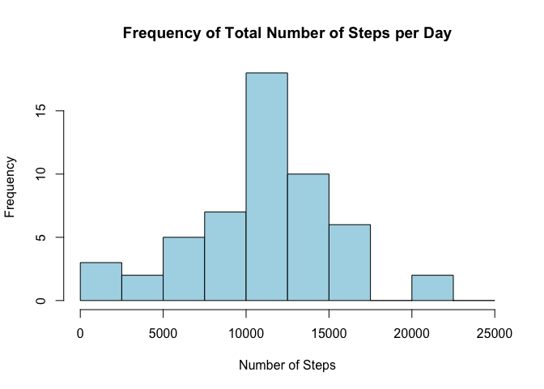
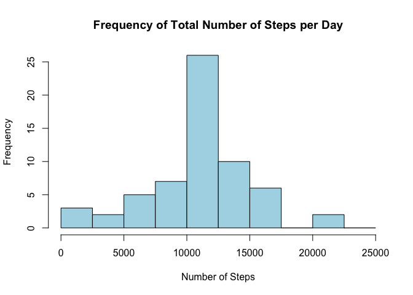

#Coursera Course
##Reproducible Research by Johns Hopkins
###*Assignment No. 1*  
Author: **omdgit**  
Date: **June 14, 2015**
<br></br>
<br></br>
This assignment makes use of data from a personal activity monitoring device. This device collects data at 5 minute intervals through out the day. The data consists of two months of data from an anonymous individual collected during the months of October and November, 2012 and include the number of steps taken in 5 minute intervals each day.  
 
<br></br>
**Provide information about the current R session.**

```r
sessionInfo()
```

```
## R version 3.1.3 (2015-03-09)
## Platform: x86_64-apple-darwin13.4.0 (64-bit)
## Running under: OS X 10.10.3 (Yosemite)
## 
## locale:
## [1] en_US.UTF-8/en_US.UTF-8/en_US.UTF-8/C/en_US.UTF-8/en_US.UTF-8
## 
## attached base packages:
## [1] stats     graphics  grDevices utils     datasets  methods   base     
## 
## loaded via a namespace (and not attached):
## [1] digest_0.6.4    evaluate_0.5.5  formatR_1.0     htmltools_0.2.6
## [5] knitr_1.6       rmarkdown_0.5.1 stringr_0.6.2   tools_3.1.3    
## [9] yaml_2.1.13
```
<br></br>  
  
Load the data and create a new data set called `activity`. 

```r
setwd("~/Documents/My Statistics/R/Classes/Johns Hopkins Data Science/05 Reproducible Research/Assignment 1")

url <- "https://d396qusza40orc.cloudfront.net/repdata%2Fdata%2Factivity.zip"
download.file(url, destfile = "./data/activity.csv", method = "curl")
unzip("./data/activity.zip")
activity <- read.csv("activity.csv", header = T, stringsAsFactors = FALSE)
str(activity)
```

```
## 'data.frame':	17568 obs. of  3 variables:
##  $ steps   : int  NA NA NA NA NA NA NA NA NA NA ...
##  $ date    : chr  "2012-10-01" "2012-10-01" "2012-10-01" "2012-10-01" ...
##  $ interval: int  0 5 10 15 20 25 30 35 40 45 ...
```
<br></br>  
  
Process/transform the data (if necessary) into a format suitable for your analysis.

```r
library(lubridate)
activity$date <- ymd(activity$date)
str(activity)
```

```
## 'data.frame':	17568 obs. of  3 variables:
##  $ steps   : int  NA NA NA NA NA NA NA NA NA NA ...
##  $ date    : POSIXct, format: "2012-10-01" "2012-10-01" ...
##  $ interval: int  0 5 10 15 20 25 30 35 40 45 ...
```
<br></br>   

<font color = "blue">**Question 1: What is the mean total number of steps taken per day?**</font>  
For this part of the assignment, missing values in the dataset are ignored by creating a new data set called `activity.clean`.  After suppressing missing values for steps, the number of rows of the new data set are printed out.  

```r
activity.clean <- activity[complete.cases(activity$steps),]
dim(activity.clean)
```

```
## [1] 15264     3
```

Calculate the total number of steps taken per day.  This can be easily achieved by using the `describe.by` function from the `psych` package which provides a great array of statistics that can be used for this analysis.  The `summary` data set is created which holds the descriptive statistics for each day.  Warning messages are suppressed for cleaner output.  The first six rows are printed out to show what's included in the data set.      

```r
options(warn = -1)
library(psych)
summary <- describe.by(activity.clean[,1:2], ymd(activity.clean$date), mat = TRUE)
head(summary)
```

```
##        item     group1 vars   n    mean      sd median trimmed mad min max
## steps1    1 2012-10-02    1 288  0.4375   6.913      0   0.000   0   0 117
## steps2    2 2012-10-03    1 288 39.4167 111.898      0   9.478   0   0 613
## steps3    3 2012-10-04    1 288 42.0694 108.602      0  13.138   0   0 547
## steps4    4 2012-10-05    1 288 46.1597 120.916      0  10.746   0   0 555
## steps5    5 2012-10-06    1 288 53.5417 121.205      0  19.552   0   0 526
## steps6    6 2012-10-07    1 288 38.2465  88.333      0  14.828   0   0 523
##        range   skew kurtosis     se
## steps1   117 16.653  277.696 0.4073
## steps2   613  3.702   13.529 6.5936
## steps3   547  3.464   11.566 6.3994
## steps4   555  3.002    7.933 7.1251
## steps5   526  2.727    6.528 7.1421
## steps6   523  3.224   10.683 5.2051
```

```r
options(warn = 0)
```
  
Limit data set just to stats for dates.  Also, calculate the sum statistic which was not included in the describe.by output and add the sum-column to the data set.  Finally, provide a more descriptive column name for the dates column and drop the row names.    

```r
summary <- summary[1:53, ]
summary$sum <- summary$n * summary$mean
colnames(summary)[2] <- "date"
rownames(summary) <- NULL
head(summary[ ,c(2, 5, 16)])
```

```
##         date    mean   sum
## 1 2012-10-02  0.4375   126
## 2 2012-10-03 39.4167 11352
## 3 2012-10-04 42.0694 12116
## 4 2012-10-05 46.1597 13294
## 5 2012-10-06 53.5417 15420
## 6 2012-10-07 38.2465 11015
```

<font color = "blue">**Make a histogram of the total number of steps taken each day.**</font>    
The bin width is customized to 2,500.

```r
hist(summary$sum, col = "lightblue", breaks=seq(0,25000,by=2500),
     main = "Frequency of Total Number of Steps per Day",
     xlab = "Number of Steps")
```

 

<font color = "blue">**Calculate and report the mean and median of the total number of steps taken per day.**</font>  

```r
round(mean(summary$sum), digits = 2)
```

```
## [1] 10766
```

```r
round(median(summary$sum), digits = 2)
```

```
## [1] 10765
```
The **mean** is <font color = "blue">10,766</font>.  
The **median** is <font color = "blue">10,765</font>. 

<font color = "blue">**Question 2: What is the average daily activity pattern?**</font>   
Make a time series plot (i.e. type = "l") of the 5-minute interval (x-axis) and the average number of steps taken, averaged across all days (y-axis).  Instead of using the `describe.by` function as above, I chose to use the `aggregate' function since it is a more straight forward approach.  It provides less information but all that is needed to create the plot.    

```r
interval.mean <- aggregate(activity.clean$steps, list(activity.clean$interval), mean)
colnames(interval.mean) <- c("interval", "mean.steps")
head(interval.mean)
```

```
##   interval mean.steps
## 1        0    1.71698
## 2        5    0.33962
## 3       10    0.13208
## 4       15    0.15094
## 5       20    0.07547
## 6       25    2.09434
```

```r
plot(interval.mean$interval, interval.mean$mean.steps, type = "n",
    main = "Average Daily Activity Pattern",
    xlab = "5-Minute-Intervals", 
    ylab = "Mean Steps")
lines(interval.mean$interval, interval.mean$mean.steps, type = "l", col = "black")
```

 

<font color = "blue">**Which 5-minute interval, on average across all the days in the dataset, contains the maximum number of steps?**</font>  
A quick way to get the interval with the maximum average number of steps is by sorting the `mean` data set that was created above by the `mean.steps` variable and picking the top row.  

```r
x <- head(interval.mean[order(-interval.mean$mean.steps), ])
x
```

```
##     interval mean.steps
## 104      835      206.2
## 105      840      195.9
## 107      850      183.4
## 106      845      179.6
## 103      830      177.3
## 101      820      171.2
```

```r
#The max is:
x[1,1]
```

```
## [1] 835
```
  
The interval with the maximum mean steps is <font color = "blue">835</font>.
<br></br>
<br></br>
<font color = "blue">**Imputing Missing Values**</font>  
Calculate and report the total number of missing values in the dataset (i.e. the total number of rows with <font color = "red">NA</font>s).

```r
activity.missing <- subset(activity, is.na(steps) | is.na(interval))
head(activity.missing)
```

```
##   steps       date interval
## 1    NA 2012-10-01        0
## 2    NA 2012-10-01        5
## 3    NA 2012-10-01       10
## 4    NA 2012-10-01       15
## 5    NA 2012-10-01       20
## 6    NA 2012-10-01       25
```

```r
nrow(activity.missing)
```

```
## [1] 2304
```

There were <font color = "blue">2,304 records</font> with NAs.

<br></br>
<font color = "blue">Devise a strategy for filling in all of the missing values in the dataset</font>  
The mean steps per 5-minute interval is used.  First, the mean steps per interval is computed.  Then the imputed steps (i.e. mean steps per interval) are appended to the data set that has NAs for the steps and the step-column with the NAs is dropped.  Finally, the data sets with observed values for the steps and the data set with imputed values for steps are combined to a final data set called `activity.new`.     

```r
library(dplyr)
```

```
## 
## Attaching package: 'dplyr'
## 
## The following objects are masked from 'package:lubridate':
## 
##     intersect, setdiff, union
## 
## The following object is masked from 'package:stats':
## 
##     filter
## 
## The following objects are masked from 'package:base':
## 
##     intersect, setdiff, setequal, union
```

```r
#Compute mean steps per interval.
by_interval <- group_by(activity.clean, interval)
interval.mean <- summarise(by_interval, mean.steps = mean(steps))
#Rename columns.
colnames(interval.mean) <- c("interval", "steps")
```

<font color = "blue">Create a new dataset that is equal to the original dataset but with the missing data filled in.</font>  

```r
#Replace missing values for steps with imputed values for steps.
activity.imputed <- merge(activity.missing[ ,2:3], interval.mean, 
                          by.x = "interval", 
                          by.y = "interval", 
                          all = TRUE)
#Rearrange the columns so the layouts are the same for all data sets before merging them.
activity.imputed <- select(activity.imputed, c(3, 2, 1))
#Combine data set that has no NAs for steps with the one that has imputed values for steps.
activity.new <- rbind(activity.clean, activity.imputed)
```

<font color = "blue">Make a histogram of the total number of steps taken each day and calculate and report the mean and median total number of steps taken per day.</font>  

```r
#Create a data set that shows the total number of steps per day.
by_date <- group_by(activity.new, date)
total.daily.steps <- summarise(by_date, total.steps = sum(steps))
head(total.daily.steps)
```

```
## Source: local data frame [6 x 2]
## 
##         date total.steps
## 1 2012-10-01       10766
## 2 2012-10-02         126
## 3 2012-10-03       11352
## 4 2012-10-04       12116
## 5 2012-10-05       13294
## 6 2012-10-06       15420
```

```r
#Create a histogram.
hist(total.daily.steps$total.steps, col = "lightblue", breaks=seq(0,25000,by=2500),
     main = "Frequency of Total Number of Steps per Day",
     xlab = "Number of Steps")
```

 

```r
mean(total.daily.steps$total.steps)
```

```
## [1] 10766
```

```r
median(total.daily.steps$total.steps)
```

```
## [1] 10766
```

<font color = "blue">Do these values differ from the estimates from the first part of the assignment? What is the impact of imputing missing data on the estimates of the total daily number of steps?</font>  
**Mean** and **median** after imputing values for missing steps:  

```r
mean(total.daily.steps$total.steps)
```

```
## [1] 10766
```

```r
median(total.daily.steps$total.steps)
```

```
## [1] 10766
```

```r
#Change in mean:
round(mean(summary$sum), digits = 2) - mean(total.daily.steps$total.steps)
```

```
## [1] 0.001321
```

```r
#Change in median:
round(median(summary$sum), digits = 2) - median(total.daily.steps$total.steps)
```

```
## [1] -1.189
```

Impact of imputation:  
The **mean** changed by <font color = "blue">0.0013</font>.  
The **median** changed by <font color = "blue">-1.1887.</font>    

<font color = "blue">Compare total daily steps of data sets without and with imputed values for missing steps.</font>  
It seems there is little impact on the total daily steps when imputing missing values for steps as shown by the graph below.  The two lines that represent the total daily steps with and without imputation are almost always on top of each other.  

```r
by_date <- group_by(activity.clean, date)
summary <- summarise(by_date, total.steps = sum(steps))

plot(summary$date, summary$total.steps, type = "n", main = "Total Steps per Day"
     , xlab = "Date", ylab = "Total Daily Steps")
lines(summary$date, summary$total.steps, type = "l", col = "black", lwd = 3)
lines(total.daily.steps$date, total.daily.steps$total.steps,type = "l", col = "red")
legend("topleft", lty = 1, col = c("black", "red"), legend = c("Not Imputed Steps", "Imputed Steps"), lwd = 3)
```

 
<br></br>

<font color = "blue">Are there differences in activity patterns between weekdays and weekends?</font>  
Create a new factor variable called `segment` in the data set with two levels - `weekday` and `weekend` indicating whether a given date is a weekday or weekend day.  

```r
#Create factor variable with two levels: weekday, weekend.
options(warn = -1)

myfactors <- factor(weekdays(activity.new$date), 
                    levels = c("Monday", "Tuesday", "Wednesday", "Thursday", "Friday", "Saturday", "Sunday"))
levels(myfactors)[1:5] <- "Weekday"
levels(myfactors)[2:3] <- "Weekend"
activity.new$segment <- myfactors
options(warn = 0)
```

<font color = "blue">Make a panel plot containing a time series plot (i.e. type = "l") of the 5-minute interval (x-axis) and the average number of steps taken, averaged across all weekday days or weekend days (y-axis). </font>    

```r
ds <- aggregate(activity.new$steps, list(activity.new$interval, 
                as.character(activity.new$segment)), 
                data = activity.new, mean)
colnames(ds) <- c("interval", "segment", "steps")

# Create the plot
library(lattice)
xyplot(steps ~ interval | segment, ds, type = "l", layout = c(1, 2)
       ,xlab = "5-Minute Intervals"
       ,ylab = "Mean Steps")
```

 


